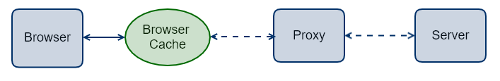

# HTTP Cache

无论是软件应用还是硬件应用，缓存都扮演着重要的角色，其重要性无可置疑。

本文主要介绍 HTTP 缓存，涉及其原理和应用。HTTP 缓存主要通过 **HTTP 首部**来控制。

## 基本概念

* 命中：请求数据不需再次下载，可以直接使用缓存数据
* 过期：缓存数据超过设置的有效时间，被标记为“陈旧”
* 验证：判断**过期缓存是否仍然有效**，需要与服务器交互
* 失效：缓存数据不再有效，需要从服务端重新下载新数据

## 基本理解

HTTP 缓存涉及到请求-响应链上的多个角色，包括浏览器、代理和服务器。其中，浏览器自身实现了缓存功能，为了便于理解，上图中把浏览器缓存从浏览器中独立出来，但是要记住浏览器缓存是浏览器的一部分。

HTTP 缓存的理解基本上可以总结为三个问题：

1. 缓存数据可以存储在哪些设备上？（WHERE）
2. 缓存数据如何判断过期？（HOW）
3. 过期缓存内容是否真的需要重新下载？（WHETHER）

问题 1 说明存储缓存数据的设备是多样的，可以存储于各级代理服务器，也可以存储于浏览器。

问题 2 说明使用什么办法来判断缓存数据是否已经过期，当然是比较时间啦，那么如何比较呢？

问题 3 说明缓存虽然过期了，但是其内容仍然可能与服务端一致，这时就没必要重新下载相同数据，只需要向服务端询问下是否可以继续使用缓存即可。

带着上面三个问题去理解 HTTP 缓存头部设置会更有助于理解和记忆。

> 有人根据是否需要进行问题 3 中的重新验证把缓存策略的设置分为强缓存和协商缓存，强缓存无须再次验证的缓存策略，协商缓存是需要再次验证的缓存策略

## 缓存首部

HTTP 缓存主要通过 HTTP 首部来实现缓存控制。这些与缓存相关的 HTTP 首部这里统称为**缓存首部**，具体首部如下表所示。

| 首部字段 | 首次定义 | 首部类型 |
| --- | --- | --- |
| Pragma | HTTP/1.0 | 通用首部 |
| Age | HTTP/1.1 | 响应首部 |
| Expires | HTTP/1.0 | 实体首部 |
| Etag | HTTP/1.1 | 响应首部 |
| If-Match | HTTP/1.1 | 请求首部 |
| If-None-Match | HTTP/1.1 | 请求首部 |
| If-Modified-Since | HTTP/1.0 | 请求首部 |
| Last-Modified | HTTP/1.0 | 实体首部 |

其中，“首次定义”是指首次出现在哪个 HTTP 版本。之所以列出这项内容，是因为实际应用需要考虑**兼容旧版 HTTP** 。

现代的 HTTP 缓存策略主要使用 `Cache-Control` 实现，它是目前最新的缓存首部，用于取代较老的缓存首部如 `Pragma` 、`Expires` 等。所以应用中应该倾向于使用 `Cache-Control` 。但是为了支持实现 HTTP/1.0 的设备，服务端通常还是都会**同时设置** `Expires`、`Pragma` 和 `Cache-Control` 等，此时 `Cache-Control` 会有**更高的优先级**。

### Cache-Control

`Cache-Control` 的内容可由多个字段组合而成，以逗号分隔，如 `Cache-Control: private,max-age=3600` 。下面对常用的可取字段进行说明。

`public`： 表示当前响应数据所有用户**共享的**，可以被任何设备缓存，包括客户端、代理服务器等。

`private`： 表示当前响应数据是单个用户所**独占的**，只能被客户端缓存，不能被代理服务器缓存。

`max-age=<seconds>`： 指定缓存的有效时间，单位为秒。其值是任意整数，0 和负数表示缓存过期，正数值加上当前响应头中的 `Date` 首部值即为过期时间。

`s-maxage=<seconds>`： 功能与 `max-age` 一致，但它**仅作用于共享缓存**，对私有缓存无效。

`no-cache`： 并非字面意思，它并非禁止缓存，而是**强制**在使用已缓存数据之前，需要去服务端**验证**一下是否可以使用缓存数据。

`no-store`： 真正的**禁止缓存**，任何设备都不允许缓存，每次请求都需要向服务端重新获取数据。

`no-transform`： 表示响应的实体数据不应被转换。`Content-Encoding` 、`Content-Range` 和 `Content-Type` 首部也不能被修改。实际应用中，有些代理服务器会对图片资源进行格式转换以节省空间或者带宽。

### Etag/If-Matched/If-None-Match

### Last-Modified/If-Modified-Since

### 其他

## 参考文章

* [HTTP/1.0, RFC1945](https://tools.ietf.org/html/rfc1945)
* [HTTP/1.0, RFC2616](https://tools.ietf.org/html/rfc2616)
* [HTTP/1.1 Caching, RFC7323](https://tools.ietf.org/html/rfc7234)
* [HTTP 缓存, Google Developers](https://developers.google.com/web/fundamentals/performance/optimizing-content-efficiency/http-caching?hl=zh-cn)

