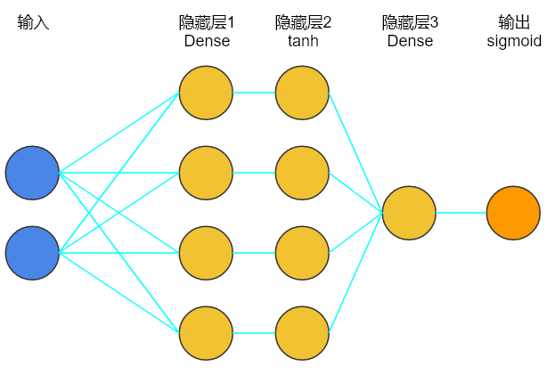
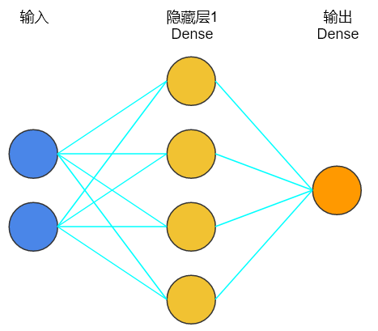

## Keras

[keras](https://keras.io/) 是一个流行的 Python 深度学习库，它以 [TensorFlow](https://github.com/tensorflow/tensorflow) ，[CNTK](https://github.com/Microsoft/cntk)，和 [Theano](https://github.com/Theano/Theano) 作为**底层库**（或者称为**后端**），提供一系列更高级的神经网络 API 。

简单来说，Keras 是对 TensorFlow，CNTK 和 Theano 更进一步的封装，以便让开发者能够更简单快速建模并验证。

值得关注的是，还有一个在浏览器运行 Keras 模型的 JS 库：[Keras.js](https://github.com/transcranial/keras-js) 。

> 附：[Python 3 快速入门](https://mmzhong.github.io/blog/2017/11/21/python-3-getting-start)

## 安装 Keras

系统信息：windows 10 x64 ，Python 3.6.4 ，Pipenv 9.0.0。

本文使用 TensorFlow 作为 Keras 的底层库（后端），因此首先需要安装 TensorFlow 。
对于 TensorFlow ，如果仅仅需要支持 CPU ，则仅需两个命令即可完成 Keras 安装：

```bash
pipenv install tensorflow
pipenv install keras
```

> 如果是自学或者代码调试，安装仅支持 CPU 的版本是满足要求的。

如果要支持 GPU ，则需要先安装 CUDA Toolkit 和 cuDNN 。

截至到 2018.02.03， TensorFlow 最新版本为 1.5.0 ，已经开始支持 CUDA 9 和 cuDNN 7 ，安装步骤如下：

1. 安装 Visiual Studio ：进入 [下载地址](https://www.visualstudio.com/)，选择 Visiual Studio IDE Community 2017，安装过程中可以不选任何其他组件
2. 安装 CUDA Toolkit ：进入 [下载地址](https://developer.nvidia.com/cuda-toolkit-archive)，选择 CUDA Tookit 9.0 ，安装完成后会自动设置相应的环境变量，验证安装是否成功：`nvcc -V`
3. 安装 cuDNN ：进入 [下载地址](https://developer.nvidia.com/cudnn)，选择 cuDNN v7.0.5 for CUDA 9.0 ，下载完成后，按照[指引](http://docs.nvidia.com/deeplearning/sdk/cudnn-install/index.html#installwindows)把对应文件拷贝到目标地址即可
4. 安装 TensorFlow ：`pipenv install tensorflow-gpu` 

注意：一定要选对版本，v9.0 就 v9.0 不要选择 v9.1 ，否则可能无法使用 TensorFlow 的预编译二进制包。

第 4 步中可能会发生 `"Unknown requires Python '>=2.6, <3' but the running Python is 3.6.4"` 的[问题](https://github.com/tensorflow/tensorflow/issues/16478)，解决办法是手动安装 `futures` : `pipenv install futures==3.1.1` ，然后再 `pipenv install tensorflow-gpu` 。

如何验证 TensorFlow 是否安装成功？

```bash
$ pipenv shell
$ python
Python 3.6.4 
>>> import tensorflow as tf
>>> hello = tf.constant('Hello, TensorFlow!')
>>> sess = tf.Session()
>>> print(sess.run(hello))
Hello, TensorFlow!
>>> 
```

注意，虽然安装的是 `tensorflow-gpu`，但是我们在导入时使用的仍然是 `tensorflow` ，而不是 `tensorflow-gpu` 。

如果输出 `Hello, TensorFlow!` ，则表示已经安装成功。否则，请参考[常见的安装错误](https://www.tensorflow.org/install/install_windows?hl=zh-cn#common_installation_problems)。

如何验证 Keras 是否安装成功？

```bash
$ pipenv shell
$ python
Python 3.6.4 
>>> import keras
Using TensorFlow backend.
>>>
```

如果输出 `Using TensorFlow backend.`，则表示已经可以使用 Keras 了。

## 基本概念

理解以下基本概念可以帮助我们更好的学习 Keras 。

### 符号计算

> 科学计算包括**数值计算**和**符号计算**两种。大部分人都知道计算机能够对数值进行一些列运算，但是不知道计算机也能够对含未知量的式子进行推导/演算。一个常见的符号计算应用是对一个函数进行求导/积分。

Keras 的底层库 TensorFlow 和 Theano 都是一个基于计算图的**符号式**库。这也决定了 Keras 的编程与传统的 Python 代码有所差别。

简单来说，符号计算首先定义各种变量，然后建立一个**计算图**（Computational Graph），该计算图规定了各个变量之间的计算关系。
建立好的计算图需要通过**编译**来确定其内部细节，编译好后的计算图就好比一个公式，没有任何实际的数据；只有把需要运算的数据输入之后，计算图才能运行起来，形成数据流，进而产生输出。

Keras 的建模跟符号计算类似，当我们的 Keras 模型搭建完毕之后，这个模型仅仅是一个空壳子，只有实际编译生成可调用函数后，输入数据才能产生真正的数据流。

这种使用计算图的库最大的缺点就是**难以调试**，没有经验的开发者很难知道计算图到底在做什么。
当然也有一些工具可以帮助开发者理解计算图结构，如 [TensorBoard](https://github.com/tensorflow/tensorboard) 。
尽管难以调试，但是目前大多数的深度学习框架都是使用符号计算这套方法，因为符号计算能够提供关键的计算优化和自动求导等功能。

### 张量

**张量**（Tensor），TensorFlow 取名的前半部分，足见张量的重要性。

张量是向量和矩阵等数据的**统一表述**，用来表示广泛的**数据类型**。

张量是有**阶数**的，或者称为**维度**。0 阶张量对应**标量**，表示单个数；1 阶张量对应**向量**，表示序列；2 阶张量对应**矩阵**，表示向量序列；3 阶张量表示矩阵序列，可以称为**立方体**，具有三个颜色通道的彩色图片就是这样一个立方体。
图片中的每个像素点 `[R, G, B]` 组成 1 阶张量（即向量），每一行像素构成 2 阶张量（即矩阵），所有像素行组合起来就构成了 3 阶张量（即立方体）。
继续把立方体作为元素组成序列，就叫 4 阶张量，以此类推。

在 Python 的科学计算库（如 numpy）中，使用**轴**（Axis）来描述维度。

```python
import numpy as np
a = np.array([[1,2,3], [4,5,6], [7,8,9]])
```

对于矩阵 `a`，它表示 2 阶张量，对应两个轴：0 轴和 1 轴。
0 轴的方向是垂直向下，1 轴的方向是水平向右。
沿着第 0 轴向右看我们可以得到 `[1,2,3]` 、 `[4,5,6]` 和 `[7,8,9]` 三个向量；
沿着第 1 轴向下看可以得到 `[1,4,7]`、`[2,5,8]` 和 `[3,6,9]` 三个向量。


取值示例：

* `a[0]` 表示取 0 轴的第 0 项，等效于 `a[0][:]`，值为 `[1,2,3]`
* `a[0][1]` 表示取 0 轴的第 0 项，再接着取 1 轴的第 1 项，值为 `2`
* `a[:][0:2]` 表示取 0 轴的全部项，但只取 1 轴的第 0 项和第 1 项，值为 `[[1,2], [4,5], [7,8]]`

> 对于 100 张 三通道 16x32 的彩色图片，Theano 和 TensorFlow 分别使用不同表达形式。
> Theano 表达为 `(100,3,16,32)` ，这种形式称为 `channel_first` ;
> TensorFlow 则表达为 `(100,16,32,3)` ，称为 `channels_last` 。
> 对于这两种形式，Keras 使用 `~/.keras/keras.json` 中的 `image_data_format` 属性指定使用哪种形式。在代码中，则可以通过`K.image_data_format()` 查看当前使用的形式。
> 要注意的是，训练和测试时请采用相同的形式。

### `batch_size`

在使用 Keras 开发时，常常会遇到参数 `batch_size` ，它是什么意思呢？

机器学习的训练过程包括模型参数的调整过程，而模型参数的调整两种以下两种方式：

1. **批梯度下降法**（Batch Gradient Descent）：遍历全部数据，然后算一次损失函数，然后算函数对各参数的梯度，从而更新参数。显然，该方法每次更新参数都要遍历所有样本，计算量开销巨大，速度缓慢。
2. **随机梯度下降法**（Stochastic Gradient Descent）：对每个数据计算损失函数，然后求梯度且更新参数。该方法速度比较快，但是收敛性不太好，可能在最优点附近徘徊，就是到不了最优点。两次参数更新也可能相互抵消，造成目标函数震荡比较剧烈。

为了克服这两种方法的缺点，现在一般采用折中的方法，称为**小批梯度下降法**（Mini-batch Gradient Descent）。它把整个数据分成若干小批，对每小批分别求梯度并更新参数。这样做是合理性的，因为同一个小批中的数据共同决定了本次梯度的方向，下降时不易跑偏，减小随机性。同时，小批的数据量不大，计算量也不会非常大。

所以，显而易见，`batch_size` 指的就是每个小批中包含的数据量或者样本量。

> Keras 中的优化器 SGD 指的就是 Stochastic Gradient Descent ，但它实际上用的仍然是小批梯度下降法。

顺便一提，开发过程中 `epochs` 参数也会频繁出现，它表示训练过程中对整个训练样本遍历多少次。一次 `epoch` 定义为所有训练样本完整走一次向前和向后传播的过程。假如训练集有 1000 样本，`batch_size = 10`，那么就有 100 个小批，因此训练完所有样本需要进行 100 次迭代，这 100 迭代就是 1 次 epoch 。如果 `epochs = 2`，那么就会对这 1000 个样本进行 2 个 100 次迭代。每个 epoch 中是会将所有样本**重新打乱分批**的，虽然这 2 个 epoch 的训练集都是这 1000 个样本，但是每次迭代的小批样本是不一样的。

### 模型

利用 Keras 开发应用的过程就是建立模型（Model）的过程。模型是一种有输入有输出的网络结构。

Keras 中的模型分为两种：序贯（Sequential）模型和函数式（Functional）模型。

序贯模型是一种**典型性**模型，拥有单输入单输出的特点，它的数据流动始终指向输出方向，层与层之间只有相邻关系，不存在跨层连接。
这种模型编译速度快，操作也简单。

函数式模型是**通用性**模型，序贯模型是它最简单的一种特例。
它可以拥有多输入多输出，层与层之间可以有更复杂的关系，比如创建共享层。序贯模型满足不了应用场景时，都应该使用函数式模型。

## 第一个模型：XOR

使用 Keras 开发机器学习应用主要包含以下五个步骤：

1. 准备数据
2. 定义模型
3. 编译模型
4. 训练模型
5. 运行模型

下面的例子使用人工神经网络（Artificial Neural Network,ANN）方式实现了`异或`逻辑操作，如 `0 ^ 1 = 1` ，模型训练好后输入 `[[0, 0]]` 将得到结果 `[[0.00156281]]` ，接近 0 。

```python
import numpy as np
from keras.models import Sequential
from keras.layers import Dense, Dropout, Activation
from keras.optimizers import SGD

# 准备数据
X = np.array([[0, 0], [0, 1], [1, 0], [1, 1]])
y = np.array([[0], [1], [1], [0]])

# 定义模型
model = Sequential()
model.add(Dense(4, input_dim=2))
model.add(Activation('tanh'))
model.add(Dense(1))
model.add(Activation('sigmoid'))

# 编译模型
model.compile(loss='binary_crossentropy', optimizer=SGD(lr=0.01))

# 输入数据，训练模型
model.fit(X, y, batch_size=1, epochs=1000)

# 使用模型预测结果
print(model.predict(X))

# output
"""
[[0.00115794]
 [0.99167705]
 [0.99117446]
 [0.01116507]]
"""
```

该实现的 ANN 模型图如下，`X` 的每个元素对应两个蓝色圆圈，`y` 每个元素对应橙色圆圈。



以上示例还可以把 `activation` 合并到 `Dense`，模型实现如下：

```python
# 定义模型
model = Sequential()
model.add(Dense(4, input_dim=2, activation="tanh"))
model.add(Dense(1, activation="sigmoid"))
```

对应的模型图为：



`Dense`：**全连接层**，它实现的操作为 `output = activation(dot(input, kernel) + bias)`，其中 `activation` 可以通过 `Dense` 的参数指定，如果不指定默认为线性激活函数 `a(x) = x` ，`kernel` 为当前层权值矩阵，`bias` 是偏置量。激活函数会逐个应用于输入的数据。

## 参考文章

* [Keras 中文文档](https://keras-cn.readthedocs.io/en/latest/)
* [Keras HelloWorld](http://keras.dhpit.com/)
