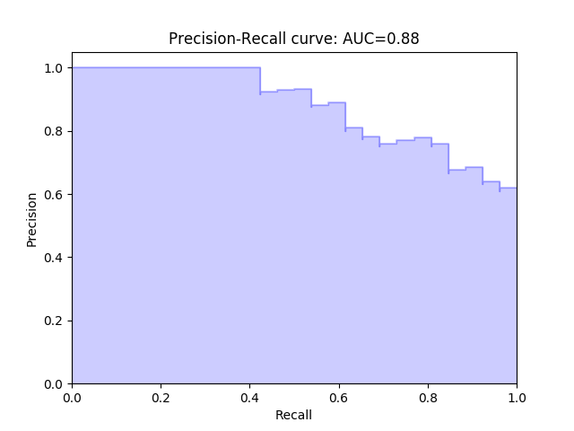

评估（Evaluation）指标用于评价学习模型的好坏。针对不同的学习场景需使用不同的评估指标。下面主要介绍**分类、拟合和聚类**三个场景的常用指标。

## 分类（Classification）

分类是一种对离散型随机变量建模或者预测的监督学习算法，常应用于邮件过滤、金融欺诈等**输出为类别**的场景。它的训练集具有**离散型**的目标变量。

分类问题可以分为二分类（Binary Classification）和多分类（Multiple Classification），两者的评估指标有所不同。

假设一个分类器应用场景：

> 某公司有程序猿70人，产品汪30人，总计100人。目标是找出所有产品汪。现在分类器挑出了50人，其中真正的产品汪只有20人，30个程序猿被错当成了产品汪。如何评估该分类器的分类效果。

此场景中，需要找出所有的**产品汪**，因此可以称产品汪为**正类**(Positive)，而程序猿称为**负类**(Negative)。

二分类场景中，预测结果只有 4 类，其混淆矩阵（Confusion Matrix）如所示：

| 预测结果\样本 | 正类 | 负类 |
| --- | --- | --- |
| 正类 | $TP$, True Positive （产品汪判断为产品汪） | $FP$, False Positive （程序猿判断为产品汪） |
| 负类 | $FN$, False Negative （产品汪判断为程序猿） | $TN$, True Negative （程序猿判断为程序猿）|

本场景中，结果如下，

| 预测结果\样本 | 正类 | 负类 |
| --- | --- | --- |
| 正类 | 真正=20 | 假正=30 |
| 负类 | 假负=10 | 真负=40 |

用汉语形容的话， $FP$ 是**误报**， $FN$ 是**漏报**。

### 准确率（Accuracy）

准确率指总样本中有多少被正确分类，即正确判断的数量与总样本数量之比，即，

$$
ACC = \frac{TP + TN}{TP + FP + FN + TN}
$$(1)

所以，上面场景的准确率为 $\frac{20 + 40}{20 + 30 + 10 + 40} = 60\%$ 。

**准确率并不能总是有效的评估分类器**，尤其是正、负类**分布极不均匀**时。例如当程序猿为 1 人，产品汪为 99 人，那么挑出 100 个人时，不用做任何训练，而是直接判断为正类，也可获得 $\frac{99 + 0}{99 + 1 + 0 + 0} = 99\%$ 的准确率。

我们仍需要其他指标来评估分类器，那就是精确率、召回率和 F-score。

### 精确率（Precision） & 召回率（Recall）

精确率指判断为正类的所有样本中有多少是真正的正类，针对的是**预测结果**。即，

$$
P = \frac{TP}{TP + FP}
$$

召回率指所有正类中有多少被判断为正类，针对的是**训练样本**。即，

$$
R = \frac{TP}{TP + FN}
$$

> 为什么叫“召回率”？可以理解为从关注领域召回目标类别的比例。

附，信息检索领域中，精确率和召回率分别称为查准率和查全率，

$$
\text{查准率} = \frac{\text{检索出的相关信息量}}{\text{检索出的信息总量}} , \text{查全率} = \frac{\text{检索出的相关信息量}}{\text{系统中相关信息总量}}
$$

一般来说，我们都希望 $P$ 和 $R$ 值都是越高越好，但是某些情况下它们是相互矛盾的。比如，仅挑出 1 个人预测为产品汪，且是正确的，那么 $P=100\%$ ，而 $R=33.33\%$ 。而挑出 100 人全部预测为产品汪，那么 $P=30\%$ ，而 $R=100\%$ 。因此，不同场合下我们需要自己判断希望是倾向于 $P$ 还是 $R$ ，这就引出了 F-score。

### F-score

> F-score 又称为 F-measure

F-score 综合了 $P$ 和 $R$ 两个指标，使用参数 $\beta$ 控制两部分的权重，计算方式如下：

$$
\frac{\beta^2 + 1}{F_\beta} = \frac{1}{P} + \frac{\beta^2}{R} \to F_\beta = \frac{(\beta^2 + 1)PR}{\beta^2P + R}
$$

当 $\beta = 1$ 时， F-score 就变成了 $P$ 和 $R$ 的**调和均值**，称为 F1-score :

$$
F_1 = \frac{2PR}{P + R}
$$

等效于，

$$
\frac{2}{F_1} = \frac{1}{P} + \frac{1}{R}
$$

$F_1$ 认为 $P$ 和 $R$ 的权重是一样的。当 $P$ 和 $R$ 都很高的情况下，$F_1$ 也会高，说明训练模型是比较有效的。可以使用 Precision-Recall 曲线来帮助分析两者之间的均衡。

### P-R Curve

P-R 曲线是当阈值（Threshold）变化时，以 $P$ 、 $R$ 值为轴绘制的曲线。阈值如何理解呢？每个分类器都是基于**概率得分**（Probability Score）来进行预测的。如果概率得分大于阈值则预测为正类，反之为负类。一般情况下，阈值为取值为 0.5 ，阈值的变化会影响到预测结果的变化。

上图为某个分类器的 P-R 曲线，观察可以发现，

1. $(P, R)=(1, 1)$ 处，即右上角，是最理想情况，说明**曲线越靠近右上角分类器性能越好**
2. $P$ 随着 $R$ 的变大而减小，再次说明了这两者之间的矛盾性，鱼和熊掌不可兼得

实际应用中，可以根据实际需求选取合理的 $(P, R)$ 。比如，在欺诈检测中，遵循的原则是“宁可错杀三千,也不放过一个”，那么就需要在合理的 $P$ 下，找到 $R$ 的最大值，此时的 $(P, R)$ 对应的阈值就是最优解。

图中浅紫色区域的面积，即曲线下方的面积称为 AUC （Area Under the Curve）。当曲线越靠近右上角，AUC 越大，分类器性能越好，因此 AUC 也是一个常用的评估指标。很明显，$0 	\leqslant AUC \leqslant 1$ 。

### ROC(Receiver Operating Characteristic)

一般地，我们说的 ROC 就是 ROC 曲线。它可以直观的评估一个分类器的好坏。

与 P-R 曲线类似，ROC 曲线的变量也是**阈值**，但是绘制的点不再是 $(P, R)$ ，而是 $(TPR, FPR)$ 。$TPR$ 即 True Positive Rate ，称为**真正率**，代表正类分对的概率； $FPR$ 即 False Positive Rate ，称为**假正率**，代表负类错分为正类的概率。计算方式如下：

$$
TPR = \frac{TP}{TP + FN} , FPR = \frac{FP}{FP + TN}
$$

> 同样理还有真负率 $TNR$ 和假负率 $FNR$ ；另，$TPR$ 又称灵敏度（Sensitivity）， $TNR$ 又称特指度（Specificity）

ROC 曲线一般长如下模样（图片来自[scikit-learn.org](http://scikit-learn.org/stable/auto_examples/model_selection/plot_roc.html)）：

观察上图我们可以总结出以下结论，

1. 左上角， $(TPR, FPR) = (1, 0) \to \begin{gathered} FN = 0 \\ FP = 0 \end{gathered}$，说明一个错误的预测都没有，是**最理想状态**
2. 右下角， $(TPR, FPR) = (0, 1) \to \begin{gathered} TP = 0 \\ TN = 0 \end{gathered}$，说明没有一个结果预测正确，是**最糟糕状态**
3. 蓝色对角线，$TPR = FPR \to \frac{TP}{FN} = \frac{FP}{TN}$，说明无论样本是正是负，判断为正或负的概率相等，也就是说分类器的预测是**完全随机**的
4. 对角线上方区域预测性能优于随机猜测，下方则劣于随机猜测
5. AUC 越大，分类器性能越优越，预测效果越准确

### 总结

上面说了那么多评估指标，到底用哪个更好呢？

评估指标的好坏主要取决于**分类器的目标**，有时也取决于应用场景。

以垃圾邮件过滤为例，通常有两种目标：

1. 过滤得更加全面：查出所有垃圾邮件，但是可能会有大量非垃圾被误判
2. 过滤得更加精准：防止正常邮件被误判，但是可能会有垃圾邮件未被识别

显然，我们会选择目标 2 ，因为它更贴合实际：重要邮件被误判成垃圾邮件造成的损失，远大于收件箱中仍出现一些垃圾邮件。这种情况下，我们就认为 $P$ 比 $R$ 更重要一些，应该在满足 $R$ 最小要求的情况下，选择更大的 $P$ 。反应到 ROC 上，会要求 FPR 尽量小。

另外，在数据分布极不均匀的情况下，比如本文在最开始的场景中，100 人中只有 1 是产品汪，那么挑出 5 人、10 人、15 人。假设都包含那 1 个产品汪，那么 $R$ 都是 $100\%$ ，而 $P$ 却只有 $\frac{1}{5},\frac{1}{10},\frac{1}{15}$ 。此时，通过 ROC 的 AUC 并不能看出多大好坏，而 P-R 曲线却更能说明问题。

## 回归（Regression）

回归是一种对数值型连续随机变量进行预测和建模的监督学习算法，常应用于房价预测、股票走势、测试成绩等**连续变化**的场景。它的训练集具有**连续型**的目标变量。

### 平均绝对误差

平均绝对误差（MAE，Mean Absolute Error）又被称为 $l_1$ 范数损失（l1-norm loss）：

$$
MAE = \frac{1}{N} \displaystyle \sum_{i=1}^N|y_i - \hat{y}_i|
$$

### 平均平方误差

平均平方误差（MSE，Mean Squared Error）又被称为 $l_2$ 范数损失（l2-norm loss）、均方误差：

$$
MSE = \frac{1}{N} \displaystyle \sum_{i=1}^N (y_i - \hat{y}_i)^2
$$

均方根误差（RMSE， Root Mean Squared Error）是均方误差的平方根，$RMSE = \sqrt{MSE}$ 。

MSE 对异常点（Outliers）比较敏感，如果回归器对某个点回归很不理想，那么该点的误差会较大，进而导致 MSE 过大。

### 中位数绝对误差

中位数绝对误差（Median Absolute Error）对异常点具有很强的鲁棒性，计算方式：

$$
MedAE = median(|y_1 - \hat{y}_1|,	\ldots ,|y_1 - \hat{y}_1|)
$$

> 鲁棒性：是 Robust 的音译，健壮和强壮的意思。在控制系统中，鲁棒性指即使系统的某些参数变动，仍能维持其它某些性能稳定的特性。此处指异常点 $MedAE$ 的影响很小。

### 判定系数

$R^2$ 称为判定系数（Coefficient of Determination，又称决定系数、拟合优度），它用于衡量模型预测未来样本的好坏程度。最理想情况为 $R^2 = 1$ ，如果 $R^2 < 0$ ，说明模型非常糟糕。

$$
R^2 = 1 - \frac{\textstyle \sum_{i=1}^{N} (y_i - \hat{y}_i)^2}{\textstyle \sum_{i=1}^{N} (y_i - \bar{y})^2} , \bar{y} = \frac{1}{N} \textstyle \sum_{i=1}^{N} y_i
$$

## 聚类（Clustering）

聚类是一种无监督学习，它基于数据的内部结构寻找观察样本的自然族群。常应用于客户细分、新闻聚类、文章推荐等。聚类通常使用**数据可视化评估结果**，因为如果存在正确答案（存在已标注的集群）的话，那么分类算法可能更加合适。

**聚类的评估参数不是很好理解，暂时不详细深入，需要可参考 [sklearn: clustering-evaluation](http://scikit-learn.org/stable/modules/clustering.html#clustering-evaluation)** 。

### Adjusted Rand Index

ARI 基于 RI（Rand Index），取值范围为 $[-1, 1]$ ，值越大意味着聚类结果与真实情况越吻合。这里的真实情况是指实际已聚类信息，说明是有监督的建模。广义上来说，ARI 是衡量两个数据分布的吻合程度。

RI 计算方式，

$$
RI = \frac{a + b}{C_2^n}
$$

然而，随机情况下，RI 并不一定接近于零。为了达到这个目标，提出了 ARI ，它具有更高的区分度：

$$
ARI = \frac{RI - E[RI]}{max(RI) - E[RI]}
$$

### 轮廓系数

轮廓系数（Silhouette Coefficient）适用于实际类别信息未知的情况。对单个样本，假设 $a$ 是与它同类别中其他样本的平均距离，$b$ 是与它距离最近不同类别中样本的平均距离，那么，

$$
s = \frac{b -a}{max(a, b)}
$$

对一个样本集合，它的轮廓系数是所有样本轮廓系数的平均值。

## 参考文章

* [准确率(Accuracy), 精确率(Precision), 召回率(Recall)和F1-Measure](https://blog.argcv.com/articles/1036.c)
* [机器学习性能评估指标](http://charleshm.github.io/2016/03/Model-Performance/)
* [精确率、召回率、F1 值、ROC、AUC 各自的优缺点是什么？
](https://www.zhihu.com/question/30643044)
* [回归、分类与聚类：三大方向剖解机器学习算法的优缺点](https://www.jiqizhixin.com/articles/2017-05-20-3)
* [sklearn: clustering-evaluation](http://scikit-learn.org/stable/modules/clustering.html#clustering-evaluation)