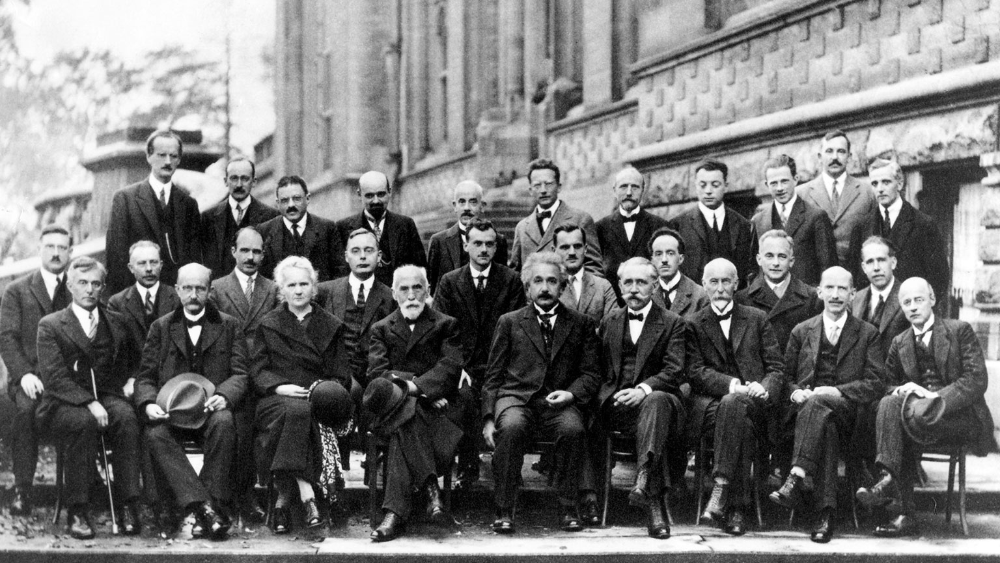

[原文：What is Quantum Computing](https://docs.microsoft.com/zh-cn/quantum/quantum-concepts-1-intro?view=qsharp-preview)

近年来，世界上出现了许多新计算机技术。其中，**量子计算**（Quantum Computing）可以说是与现有的编程范式差异最大的技术。量子计算机的概念最早由 Richard Feynman 和 Yuri Manin 于上世纪 80 年代提出。
说到量子计算，大家第一时间可能想到的是，它常常被认为是物理学上的最糗事之一。因为它是一种巨大科学进步，但却连最简单的系统都无法完成建模。
众所周知，量子力学（Quantum Mechanics）是在 1900 至 1925 年间发展起来的，之后便成为了化学、凝聚态物理学和从计算机芯片到 LED 照明灯各种技术的基石。
不同的是，这些领域都取得了巨大的成功，但是量子力学最简单的系统模型似乎都超越人类所能而无法完成。这是因为即使模拟仿真只有几十个相互作用的粒子的模型，都要耗费常规计算机需要运行上千年才能达到的计算能力。

除此之外，还有其他方式可以帮助我们理解为什么量子力学难以模拟仿真。也许最简单的理解方式是，量子理论可以被解释为：在量子层面上，同一个物质可同时处于许多不同的可能状态。
这与经典概率论大有不同，量子的这些可能状态是能够被观测到的，但它们会像潮汐中的波浪一样互相干涉。正是这些干涉导致我们无法使用统计采样来获取量子的状态。
因此，如果我们想要掌握量子的演化过程，我们必须跟踪量子系统可能存在的**每一种可能状态**。

假设在一个电子系统中，每个电子都可能有 40 种位置（通过叠加实现），那么这个电子系统就可能处于 2^40 种状态的任何一种，因为每个位置都可能有或者没有电子。如果使用常规计算机内存来存储这个电子系统的所有量子态，那将会占用超过 130 GB 的内存空间。这个数值虽然很大，但我们的常规计算机仍然可以实现。
如果我们假设每个电子可能有 41 中位置呢？那将会有 2^41 种状态，需要超过 260 GB 的内存才能存得下。
如果我们继续提高电子可能的位置，那即使使用当今世界最强大的计算机，它的内存都会被消耗殆尽。
但是在自然界，根据量子力学定律，这样的系统却无时不刻地在演变，而且我们很难意识到：我们无法使用传统计算能力来设计和模拟这些演变。

依据这种观察结果，早期的量子计算观点提出了一个简单却强而有力的问题：我们能否把这个艰难的挑战转化为机遇？
具体来说，如果我们连量子动力学都难以模拟仿真，更何况造出能够把量子效应转为基本指令的硬件呢？我们能否使用一套拥有与量子完全相同规律的系统来模拟相互作用的粒子并控制它们？我们能否研究完全不存在于自然的、但仍遵循量子力学定律的任务并且从中获益？
正是这些问题引发了人们对量子计算研究的起源。

量子计算的基础核心是把信息存储在物质的量子态中，然后使用量子门操作，通过利用和学习来对量子干涉（Quantum Interference）进行“编程”，从而完成对信息的计算。
早在 1994 年，Peter Shor 通过对干涉进行编程解决了传统计算机认为很难的问题：因子分解。
解决因子分解问题能够严重威胁到当今电子商务安全立足的许多公钥密码系统，包括 RSA 和椭圆曲线密码学。
从那以后，更快更高效的量子计算机算法被发展出来，用以解决经典的难题，包括：

* 模拟化学、物理和材料学中的物理系统
* 搜索无序数据库
* 求解线性方程组
* 机器学习

设计一个量子程序来控制干涉可能听起来像是一项艰巨的挑战。尽管如此，许多技术和工具，包括微软的量子开发套件（QDK），已经被开发出来，使得量子编程和算法研究变得更加触手可及。
已经有一些基本策略可以用来操控量子干涉，它们不仅有利于计算，同时又能保证计算结果不会在一系列的量子可能性中消除。
量子编程是一门独特的艺术，与经典编程相比，他需要非常不同的工具来理解和表达量子算法的思想。
实际上，如果没有这些通用工具辅助量子开发者的话，那么量子算法的开发就没那么容易了。

为此，我们提供了微软量子开发套件，以促进社区的不断繁荣增长，为他们的任务，问题和解决方案开启量子革命。
我们还设计开发了高级编程语言---Q#，旨在解决量子信息处理的挑战。它集成在软件套件中，可以将量子算法编译成量子计算的基本操作。
在接触 Q# 之前，我们会带领大家回顾量子计算的基本规律，以帮助我们更好地理解这门语言。期间，我们将把量子计算的基本规律作为公理来理解，而不是详细说明它们在量子力学中基本作用。
此外，我们假设您已经掌握基本的线性代数，如向量、矩阵等。
如果想更深入的了解量子计算历史和原理，请参考包含更多信息的[参考章节](https://docs.microsoft.com/zh-cn/quantum/quantum-formoreinfo?view=qsharp-preview)。
