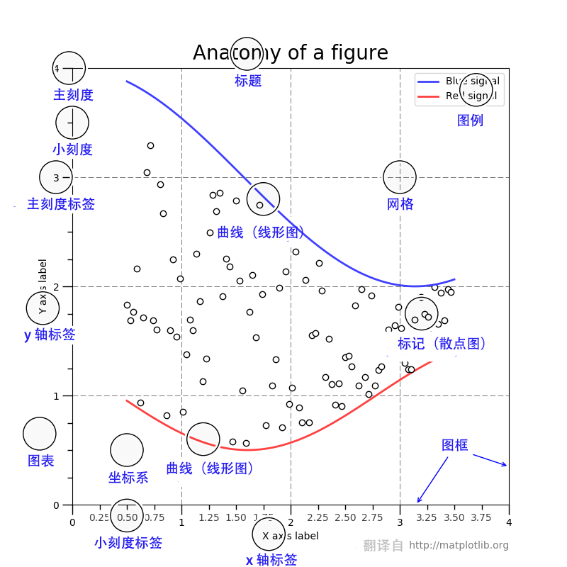
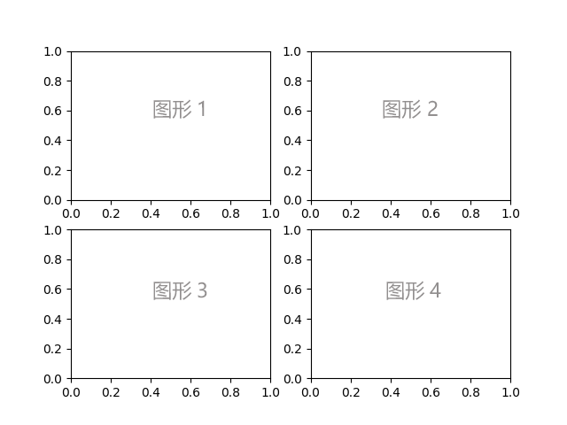
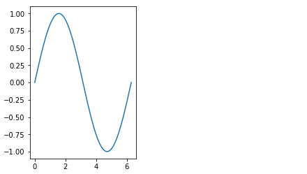
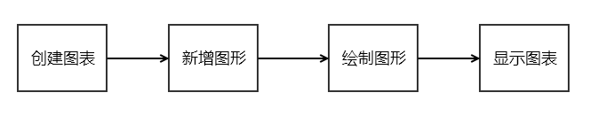
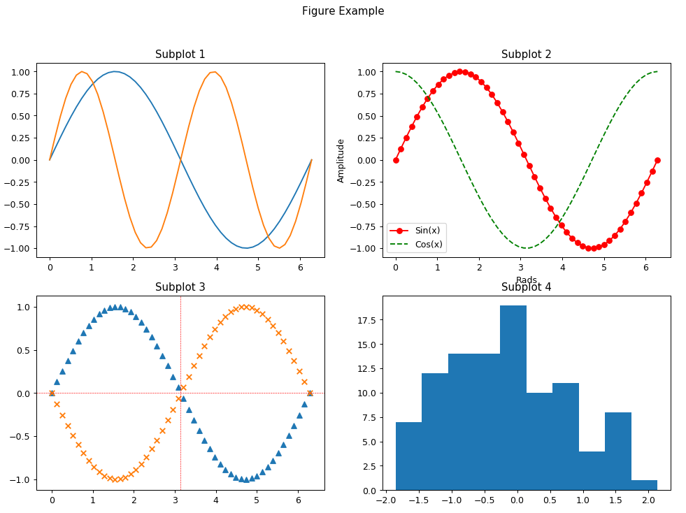

---
title: 快速入门 Matplotlib 绘图库
createdDate: 2018-03-21
tags: python,matplotlib
desc: Python 绘图库 Matplotlib 快速入门
--- 


## 概述

Matplotlib 是使用 Python 开发的一个**绘图库**，是 Python 界进行数据可视化的首选库。
它提供了绘制图形的各种工具，支持的图形包括简单的散点图、曲线图和直方图，也包括复杂的三维图形等，基本上做到了只有你想不到，没有它做不到的地步。可以通过[图形示例](https://matplotlib.org/gallery.html)来快速浏览所有支持的图形。

## Hello Matplotlib

从最简单开始，绘制一条正玄曲线：

```python
import numpy as np
import matplotlib.pyplot as plt

x = np.linspace(0, 2 * np.pi, 50)
y = np.sin(x)
plt.plot(x, y)
plt.show()
```

运行后看到的结果类似为：


最开始时，引入相关模块并重命名为 `np` 和 `plt` ，其中 `np` 用来生成图形数据，`plt` 就是我们的绘图模块。

接着使用 `np.linspace` 生成了包含 50 个元素的数组作为 x 轴数据，这些元素均匀的分布在 `[0, 2π]` 区间上。然后使用 `np.sin` 生成 `x` 对应的 y 轴数据。

再接着 `plt.plot(x, y)` 会自动创建一个图形，并把 `x` 和 `y` 绘制到图形上。

最后，调用 `plt.show()` 把绘制好的图形显示出来。

注意，使用 `plot()` 方法时我们传入了两组数据： `x` 和 `y`，分别对应 x 轴和 y 轴。如果仅仅传入一组数据的话，那么该数据就是 y 轴数据， x 轴将会使用数组索引作为数据。例如 `plt.plot(y)` 的结果为：


## 图表组成

从上面绘制的图表中，可以看到它包含有 x 、y 轴刻度和曲线本身，但一个完整的图表还可以展示更多的信息。

下图展示了图表的所有元素：



图表是用户所见的整张图片，它管理着所有的坐标系，辅助元素（标题、图例等）和画布。只要知道画布是真正绘制图形的地方就可以了，对它不用了解太多。一张图表可以有多个坐标系，因为它可以有多个图形，一个坐标系只能属于一张图表。比如下图，



它在一张图表内画了四个图形，每个图形都有自己独立的坐标系。二维坐标系包含两条坐标轴，三维的话则是三条。

注意区分图表和图形，图表是整张图片，图形是图表的一部分。

## 另一种编程风格

在前面绘制正玄曲线的代码中，可能并不太好理解图表是何时、如何创建的。
下面换用另一种编程风格实现相同的正玄曲线图形，这可以帮助我们理解更详细的过程。

```python
import numpy as np
import matplotlib.pyplot as plt

x = np.linspace(0, 2 * np.pi, 50)
y = np.sin(x)

fig = plt.figure()
ax = fig.add_subplot(1, 1, 1)
ax.plot(x, y)

plt.show()
```

可以看出，与之前的编码相比，这里多了两行代码，而且使用 `ax` 代替 `plot` 来绘制图形。
其中，`fig = plt.figure()` 显式创建了一个图表对象 `fig`，刚创建的图表此时还是空的，什么内容都没有。
接着，`ax = fig.add_subplot(1, 1, 1)` 往图表中新增了一个图形对象，返回值 `ax` 为该图形的坐标系。

`add_subplot()` 的参数指明了图形数量和图形位置。`(1, 1, 1)` 对应于 `(R, C, P)` 三个参数，`R` 表示行，`C` 表示列，`P` 表示位置。因此，`(1, 1, 1)` 表示在图表中总共有 `1 x 1` 个图形，当前新增的图形添加到位置 `1` 。
如果改为 `fig.add_subplot(1, 2, 1)` 则表示图表拥有 1 行 2 列总共有 2 个图形，最终展示结果为：



右边的空白处为位置 `2` 的图形位置，因为没有往该位置添加图形，所以显示为空白。

`(1, 1, 1)` 也可以简写为三个数字组成的三位整数，即 `plt.add_subplot(111)` 。

这种编程风格更符合程序员的编程习惯，所以推荐使用这种编程风格。

使用这种编程风格时，Matplotlib 的基本使用过程可总结如下：



## 应用实践

利用上面学到的概念，下面绘制了一个更复杂些的图表，里面使用了一些常用接口，最终效果如下：



代码实现：

```python
import numpy as np
import matplotlib.pyplot as plt

x = np.linspace(0, 2 * np.pi, 50)

# 创建图表
fig = plt.figure(figsize=(13, 9), dpi=90)
fig.suptitle('Figure Example')

# 绘制图形 1
ax1 = fig.add_subplot(2, 2, 1)
ax1.set_title('Subplot 1')
ax1.plot(x, np.sin(x))
ax1.plot(x, np.sin(2 * x))

# 绘制图形 2
ax2 = fig.add_subplot(2, 2, 2)
ax2.set_title('Subplot 2')
ax2.plot(x, np.sin(x), 'r-o', label='Sin(x)')
ax2.plot(x, np.cos(x), color='green', linestyle='dashed', label='Cos(x)')
ax2.legend()
ax2.set_xlabel('Rads')
ax2.set_ylabel('Amplitude')

# 绘制图形 3
ax3 = fig.add_subplot(2, 2, 3)
ax3.set_title('Subplot 3')
ax3.scatter(x, np.sin(x), marker='^')
ax3.scatter(x, np.cos(x + np.pi / 2), marker='x')
ax3.axhline(0, color='red', linestyle='dashed', linewidth=0.5)
ax3.axvline(np.pi, color='red', linestyle='dashed', linewidth=0.5)

# 绘制图形 4
fig.add_subplot(2, 2, 4)
ax4 = fig.axes[3]
ax4.set_title('Subplot 4')
ax4.hist(np.random.randn(100), 10)

plt.show()
```

如果想对图形做更多自定义的部分，可以在 [Axes API](https://matplotlib.org/api/axes_api.html#axes-position) 查询相关接口。