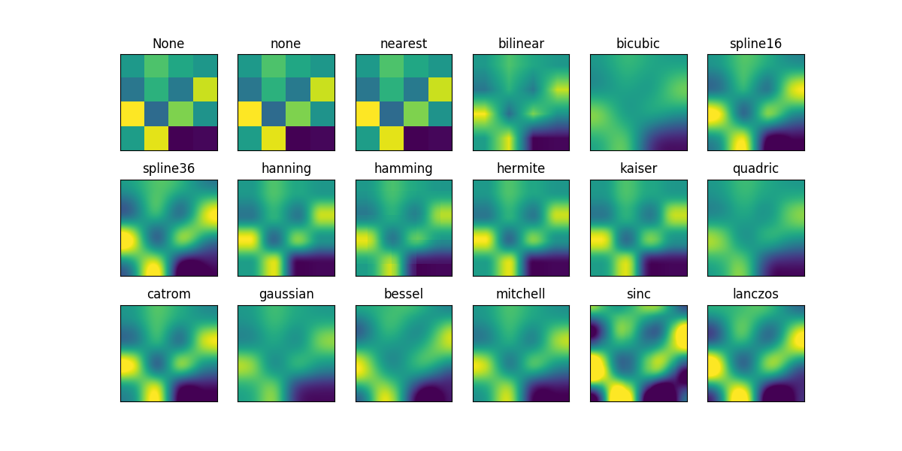
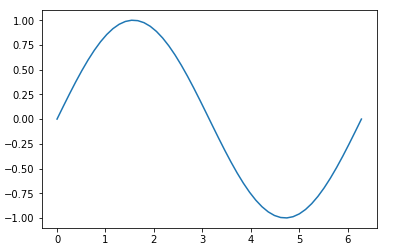
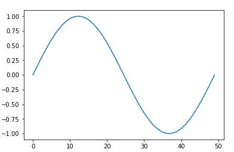

---
title: 快速入门 Matplotlib 绘图库
createdDate: 2018-03-21
tags: python,matplotlib
desc: Python 绘图库 Matplotlib 快速入门
--- 

## 概述



Matplotlib 是使用 Python 开发的一个**绘图库**，是 Python 界进行数据可视化的首选库。
它提供了绘制图形的各种工具，支持的图形包括简单的散点图、曲线图和直方图，也包括复杂的三维图形等，基本上做到了只有你想不到，没有它做不到的地步。可以通过[图库](https://matplotlib.org/gallery.html)来快速浏览所有支持的图形。

## Hello Matplotlib

从最简单开始，绘制一条正玄曲线：

```python
import numpy as np
import matplotlib.pyplot as plt

x = np.linspace(0, 2 * np.pi, 50)
y = np.sin(x)
plt.plot(x, y)
plt.show()
```

运行后看到的结果类似为：



最开始时，引入相关模块并重命名为 `np` 和 `plt` ，其中 `np` 用来生成图形数据，`plt` 就是我们的绘图模块。

接着使用 `np.linspace` 生成了包含 50 个元素的数组作为 x 轴数据，这些元素均匀的分布在 `[0, 2π]` 区间上。然后使用 `np.sin` 生成 `x` 对应的 y 轴数据。

再接着就开始绘制了，使用 `plt.plot(x, y)` 把 `x` 和 `y` 绘制到了图形上。

最后，调用 `plt.show()` 把绘制好的图形显示出来。

注意，使用 `plot()` 方法时我们传入了两组数据： `x` 和 `y`，分别对应 x 轴和 y 轴。如果仅仅传入一组数据的话，那么该数据就是 y 轴数据， x 轴将会使用数组索引作为数据。例如 `plt.plot(y)` 的结果为：



