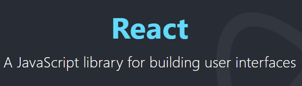
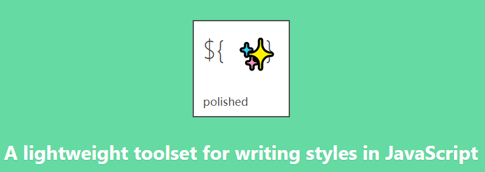
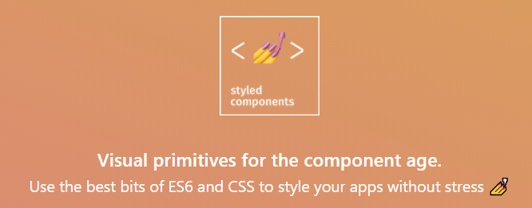
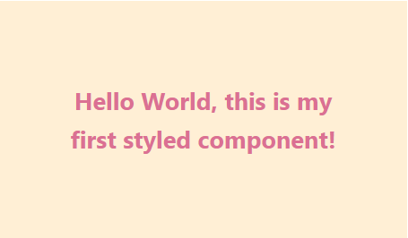
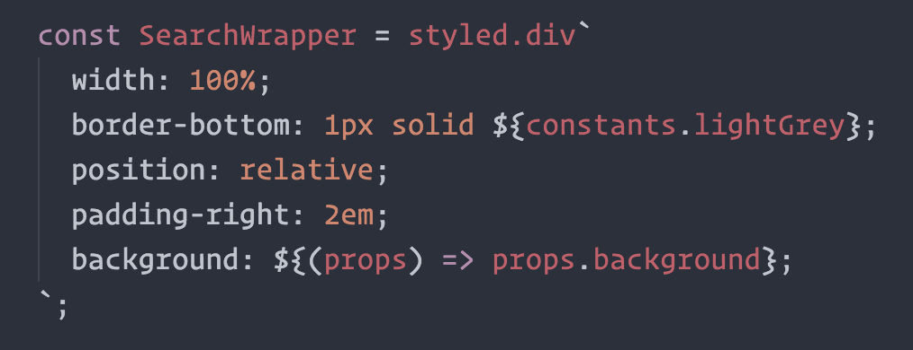

在 React 中写 CSS 一直是大家觉得不太爽的地方。
有没有一种更好的 CSS 方案呢？对于这个问题，社区也一直在探索，从未停止过。

本文介绍了 React 相关的三种 CSS 方案，希望能够帮助大家在 React 路上越走越顺畅。

## CSS as Object

在 React 中，一切皆为 JS 。包括看起来像是 HTML 的 JSX ，它最终也还是转化为 JS 。CSS 也不例外，它必须被表述为 JS 对象才能在组件中使用。作为最原始的方案，它由 Facebook 官方提出，并且开启了 CSS in JS 的热潮。

最原始的用法如下所示：

```js
const divStyle = {
  color: 'blue',
  fontSize: 20,
  WebkitTransition: 'all',
  msTransition: 'all',
};
const HelloWorldComponent = () => (
  <div style={divStyle}>Hello World!</div>
);
```

从中可以看出，开发者首先要使用 JS 对象来书写 CSS ，然后通过 `style` 属性赋值给组件元素。在 React 内部，会把这个 CSS 对象转化为样式字符串，最终渲染的时候变成元素的行内样式。

这种方式有以下让人诟病的地方：

* 样式属性名称的命名方式与传统 CSS 不同
* 样式属性名称无法自动提示并补全
* 样式值略有差异，如上例中的字体大小 `20px` 写为 `20`
* 无法充分利用自动补全浏览器前缀的功能，需要手动添加前缀
* 无法抽离成独立的样式文件
* 无法有效复用基础样式

如果仔细看上面的代码的话，可以发现样式属性名称的命名并不是驼峰式命名那么简单，它还存在一些不规则的命名。比如 `WebkitTransition` 中的 `W` 是大写的，`msTransition` 中的 `m` 则是小写的。

为了改善这些弊端，社区中出现了轻量级的小工具 [`polished.js`](https://github.com/styled-components/polished)。

## CSS as Function



`polished.js` 是一个 CSS in JS 的轻量级工具集。最早的版本 [v1.0.1](https://github.com/styled-components/polished/releases/tag/v1.0.1) 发布于 2017.03.30 ，至今将近一年。
它总共封装了以下五大类别的工具函数：

* 混合函数（Mixins）
* 颜色函数（Color）
* 快捷函数（Shorthands）
* 帮助函数（Helpers）
* 类型函数（Types）

使用这些函数可以让我们不用直接编写样式属性名称，也在一定程度上实现了样式复用。

来看下具体的例子：

```js
import { wordWrap } from 'polished';

const style = {
  ...wordWrap('break-word')
}

// 等效于

const style = {
  overflowWrap: 'break-word',
  wordWrap: 'break-word',
  wordBreak: 'break-all',
}
```

或者更简单的例子：

```js
import { size } from 'polished';

const style = {
  ...size('300px', '250px')
}

// 等效于

const style = {
  height: '300px',
  width: '250px'
}
```

可以看出，这工具函数确实能提高一些编码效率。但是，记住这些工具函数也加大了学习成本，给人一种得不偿失的感觉。因此，这种方案也没能流行起来，我们仍然需要一种更好的 CSS 编码方案。

## CSS as Component

`polished.js` 虽然并没有流行起来，但是他们的开发团队却整出了另一个更加绝妙的方案，那就是**样式化组件**（[Styled Components](https://www.styled-components.com/)）。



样式化组件巧妙地利用 ES6 标签模板把 CSS 和组件结合在一起，使得组件跟样式之间的界限变得模糊。这意味着，当我们在写样式的时候，我们其实也在定义一个普通的 React 组件。反过来，开发者也可以像写组件一样，非常自然地写样式。

> 如果对标签模板还不太了解，可以参考[ECMAScript 6 入门](http://es6.ruanyifeng.com/?search=%E6%A8%A1%E6%9D%BF&x=8&y=4#docs/string#%E6%A0%87%E7%AD%BE%E6%A8%A1%E6%9D%BF)，里面有详细的讲解。

事不宜迟，来看看这种巧妙地写法：

```js
import React from 'react';
import { render } from 'react-dom';
import styled from 'styled-components';

const Title = styled.h1`
  font-size: 1.5em;
  text-align: center;
  color: palevioletred;
`;

const Wrapper = styled.section`
  padding: 4em;
  background: papayawhip;
`;

render(
  <Wrapper>
    <Title>
      Hello World, this is my first styled component!
    </Title>
  </Wrapper>,
  document.getElementById('root')
);
```

上面我们先后使用 `styled.h1` 和 `styled.section` 创建了 `Title` 和 `Wrapper` 两个组件，它们会生成包含相应样式的 `<h1>` 和 `<section>` 标签。由于 `Title` 和 `Wrapper` 都是组件，因此我们可以跟其他任何 React 组件一样使用它们，最终的效果如下：



使用样式化组件来写样式跟普通的 CSS 写法是一模一样的。也不用担心自动补全、浏览器前缀自动补全和语法高亮等问题，这些都有很好的[工具](https://www.styled-components.com/docs/tooling)支持，适合所有主流编辑器。

比如语法高亮后长这般模样：



当然，`styled-component` 还支持很多其他高级功能，比如设置样式主题、组件复用、样式拓展、媒体模板等，更详细的用法请参考[官方文档](https://www.styled-components.com/docs)。

除此以外，它还建立起了自己的生态，提供了丰富的基本样式化组件、网格系统和辅助插件等等。

可以说，`styled-components` 让 React 组件开发变得更加轻松愉悦！

最后，Happy Coding~